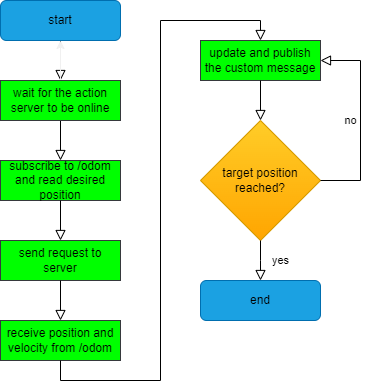

# RT1_assignment_2
In this assignemnt the tasks were to implement three programs:
1. A node functioning as an action client and as a publisher of a custom containing the current position and speed of the robot controlled by the action server;
2. A server node tasked with returning when called the last target position sent to the action server;
3. A server node tasked with computing and providing when requested the actual distance of the robot from the target position and its average movement speed using a subscription to the custom message published by the action client.

## Flowchart of the action client
Here is shown a flowchart describing the behaviour of the action client:

## How to run it
After the download of the files you need to compile the package using catkin_make on the ROS workspace in which the package is saved. Once that is done, running after `roscore` the launch file *assignment_2.launch* using the command:

`roslaunch assignment_2_2023 assignment_2.launch`.
In this launch file you can modify the desired position set as you launch the simulation and also the width of the averaging window for the third node (that is to say the number of elements the server uses to compute the average speed).

after having started the simulation you can set a new target position by running:

`rosrun assignment_2_2023 reach_position des_x:=x des_y:=y`
where 'x' and 'y' are to be raplaced with the corresponding values for the x and y coordinates of the target position.

## Possible improvements

One of the possible ways to improve this package might be to give the action client the capability of changing the target while functioning and of stopping the server based on user input
